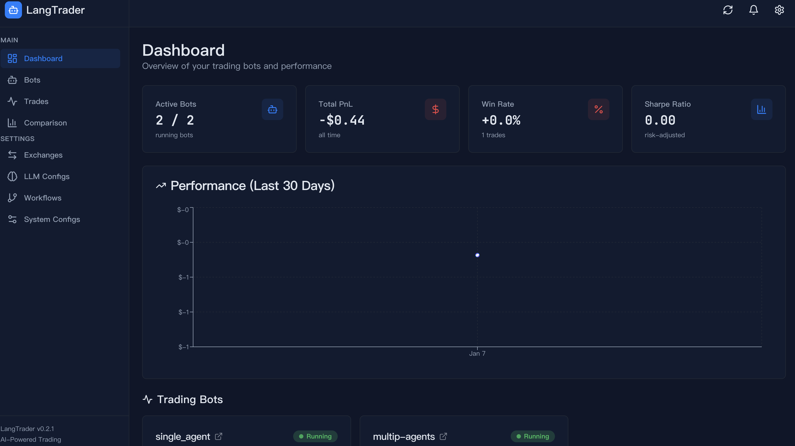
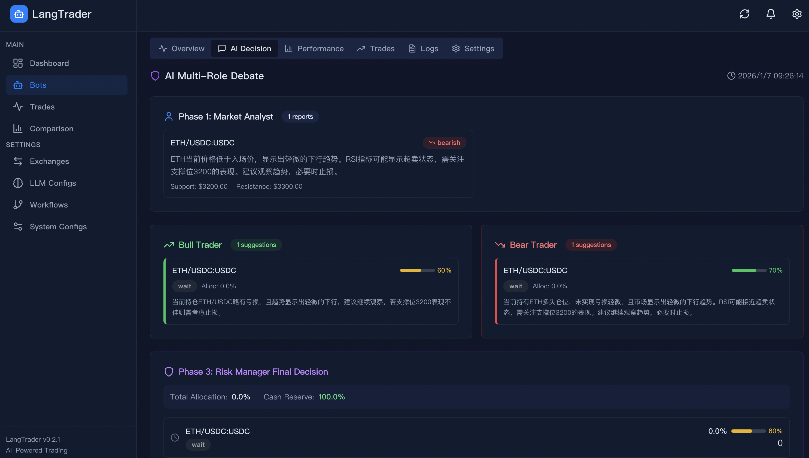
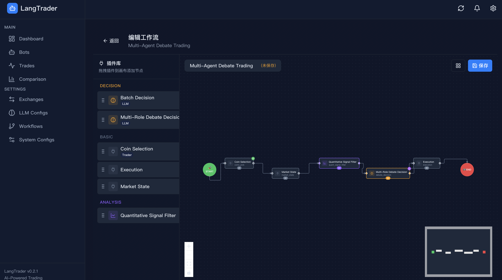
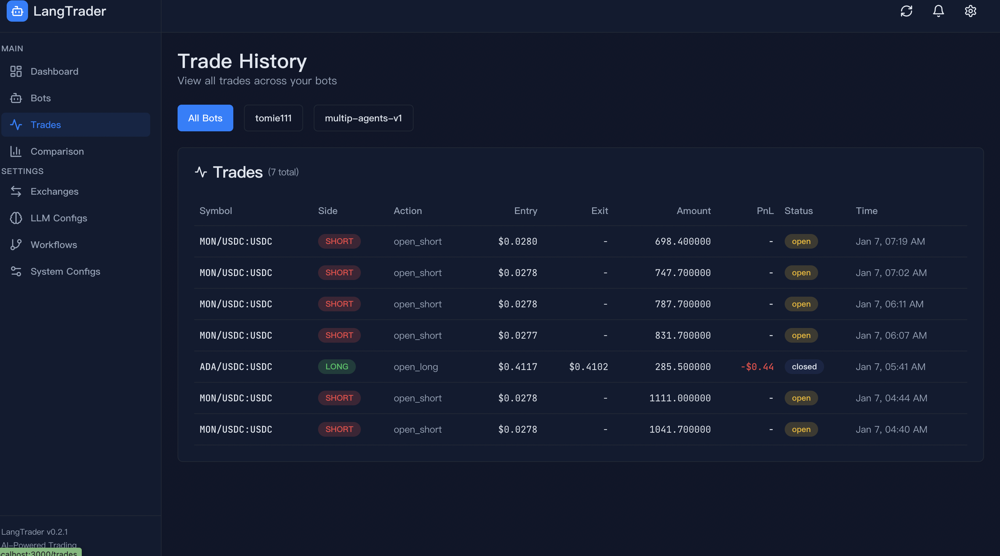
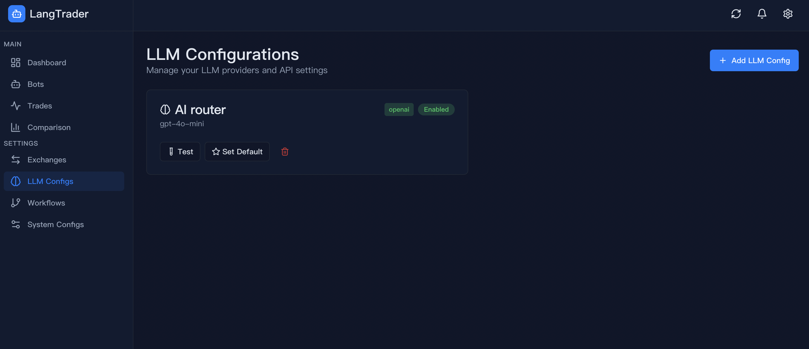

<div align="center">

# 🤖 LangTrader Agents

**AI 驱动的量化交易系统 | AI-Powered Quantitative Trading System**

基于 LangGraph 构建的智能加密货币交易代理，融合技术分析与大语言模型决策

[](https://www.python.org/)
[](https://nextjs.org/)
[](https://github.com/langchain-ai/langgraph)
[](https://www.postgresql.org/)
[](https://docker.com/)
[](LICENSE)

<br/>

[](https://openai.com/)
[](https://anthropic.com/)
[](https://ollama.ai/)
[](https://github.com/ccxt/ccxt)
[](https://fastapi.tiangolo.com/)

<br/>

**⭐ 如果这个项目对你有帮助，请给一个 Star 支持！⭐**

[English](#english) | [中文](#中文)

</div>

---

## 📸 项目截图 | Screenshots

<table>
<tr>
<td width="50%">

### Dashboard
<!-- TODO: 添加 Dashboard 截图 -->
<p align="center">
  
  <br/>
  <em>主控制台 - 显示所有 Bot 状态概览</em>
</p>

</td>
<td width="50%">

### Bot Detail
<!-- TODO: 添加 Bot Detail 截图 -->
<p align="center">
  
  <br/>
  <em>Bot 详情页 - 余额、持仓、PnL 实时监控</em>
</p>

</td>
</tr>
<tr>
<td width="50%">

### AI Decision
<!-- TODO: 添加 AI Decision 截图 -->
<p align="center">
  
  <br/>
  <em>AI 决策可视化 - 辩论过程与最终决策</em>
</p>

</td>
<td width="50%">

### Workflow Editor
<!-- TODO: 添加 Workflow Editor 截图 -->
<p align="center">
  
  <br/>
  <em>工作流编辑器 - 可视化拖拽配置</em>
</p>

</td>
</tr>
<tr>
<td width="50%">

### Trade History
<!-- TODO: 添加 Trade History 截图 -->
<p align="center">
  
  <br/>
  <em>交易历史 - 完整交易记录追溯</em>
</p>

</td>
<td width="50%">

### Settings
<!-- TODO: 添加 Settings 截图 -->
<p align="center">
  
  <br/>
  <em>配置管理 - 交易所/LLM/系统参数</em>
</p>

</td>
</tr>
</table>

> 📷 **注**: 截图目录 `docs/images/` 需要手动添加项目截图

---

## 中文

### 📖 项目简介

LangTrader Agents 是一个**模块化、可扩展**的 AI 量化交易系统。它将传统技术分析与大语言模型（LLM）的推理能力相结合，实现智能化的交易决策。

系统采用 **LangGraph StateGraph** 作为工作流引擎，支持**热插拔节点**架构，所有配置存储于 PostgreSQL 数据库，支持**零重启热更新**。

### ✨ 核心特色

<table>
<tr>
<td width="50%">

#### 🔌 热插拔插件架构
- 节点自动发现与注册
- 运行时动态加载/卸载
- 无需重启即可扩展功能

#### 🤝 多 Agent 协作
- **单 Agent 模式**：快速决策，低延迟
- **多 Agent 辩论模式**：4 角色（分析师/多头/空头/风控）辩论，提高决策质量

#### 🔧 集中配置管理
- 数据库驱动配置（PostgreSQL）
- 60 秒自动热重载
- 零硬编码，完全可配置

</td>
<td width="50%">

#### 🌐 70+ 交易所支持
- 基于 CCXT Pro 统一接口
- 支持 Hyperliquid、Binance、OKX 等
- WebSocket 实时数据流

#### 📊 量化信号引擎
- 趋势/动量/波动率/成交量 多维度分析
- 可配置权重和阈值
- 自动过滤低质量信号

#### 🛡️ 智能风控系统
- 总敞口/单币种敞口限制
- 连续亏损熔断
- 资金费率监控
- 执行失败反馈学习

</td>
</tr>
</table>

### 🛠️ 技术栈

| 层级 | 技术 | 说明 |
|------|------|------|
| **Frontend** | Next.js 15, React 19, TailwindCSS, TanStack Query | 现代化 Web 界面 |
| **Backend** | FastAPI, Python 3.12+, SQLModel | 高性能异步 API |
| **Database** | PostgreSQL 15+ | 配置存储与状态持久化 |
| **Workflow** | LangGraph, LangChain | AI 工作流编排 |
| **Exchange** | CCXT Pro | 70+ 交易所统一接口 |
| **LLM** | OpenAI, Anthropic, Ollama, DeepSeek | 多提供商支持 |
| **Deploy** | Docker Compose | 一键容器化部署 |

### 🏗️ 系统架构

```
┌─────────────────────────────────────────────────────────────────────────────┐
│                           LangTrader Agents                                  │
├─────────────────────────────────────────────────────────────────────────────┤
│                                                                              │
│  ┌─────────────────────────────────────────────────────────────────────┐    │
│  │                        Frontend (Next.js)                            │    │
│  │   Dashboard │ Bot Management │ Workflow Editor │ Trade History       │    │
│  └──────────────────────────────┬──────────────────────────────────────┘    │
│                                 │ REST API / WebSocket                       │
│  ┌──────────────────────────────▼──────────────────────────────────────┐    │
│  │                        Backend (FastAPI)                             │    │
│  │   Auth │ Bot Control │ Status │ Trades │ Performance │ Configs       │    │
│  └──────────────────────────────┬──────────────────────────────────────┘    │
│                                 │                                            │
│  ┌──────────────────────────────▼──────────────────────────────────────┐    │
│  │                    LangGraph Workflow Engine                         │    │
│  │  ┌──────────┐ ┌──────────┐ ┌──────────┐ ┌──────────┐ ┌──────────┐   │    │
│  │  │ coins    │→│ market   │→│ quant    │→│ debate/  │→│execution │   │    │
│  │  │ _pick    │ │ _state   │ │ _filter  │ │ batch    │ │          │   │    │
│  │  └──────────┘ └──────────┘ └──────────┘ └──────────┘ └──────────┘   │    │
│  └─────────────────────────────────────────────────────────────────────┘    │
│                                                                              │
│  ┌──────────────────────────────────────────────────────────────────────┐   │
│  │  Services: Trader │ Market │ Indicators │ Performance │ Cache        │   │
│  ├──────────────────────────────────────────────────────────────────────┤   │
│  │  LLM Factory: OpenAI │ Anthropic │ Ollama │ DeepSeek │ 智谱          │   │
│  ├──────────────────────────────────────────────────────────────────────┤   │
│  │  Exchange (CCXT Pro): 70+ Exchanges with WebSocket Support           │   │
│  └──────────────────────────────────────────────────────────────────────┘   │
│                                                                              │
└─────────────────────────────────────────────────────────────────────────────┘
```

### 📦 工作流节点

| 节点 | 功能 | 特点 |
|------|------|------|
| `coins_pick` | 选币 | 按成交量/OI 动态筛选 |
| `market_state` | 市场数据 | 多时间框架 K 线 + 指标计算 |
| `quant_signal_filter` | 量化过滤 | 多维度评分，过滤噪音 |
| `batch_decision` | 批量决策 | 单 Agent 快速决策 |
| `debate_decision` | 辩论决策 | 4 Agent 多角色辩论 |
| `execution` | 执行交易 | 风控验证 + 订单执行 |

### 🚀 快速开始

#### 方式一：Docker 部署（推荐）

```bash
# 1. 克隆项目
git clone https://github.com/neilzhangpro/LangTrader.git
cd langtrader-agents

# 2. 配置环境变量
cp .env.example .env
# 编辑 .env 填入数据库密码和 API 密钥

# 3. 一键启动
docker compose up -d --build

# 4. 访问界面
# 前端: http://localhost:3000
# API: http://localhost:8000/api/docs
```

#### 方式二：本地开发

```bash
# 1. 克隆项目
git clone https://github.com/neilzhangpro/LangTrader.git
cd langtrader-agents

# 2. 安装 Python 依赖
uv sync

# 3. 安装前端依赖
cd frontend && npm install && cd ..

# 4. 配置环境变量
cp .env.example .env
# 编辑 .env 填入数据库和 API 密钥

# 5. 初始化数据库
psql -d langtrader -f langtrader_pro_init.sql

# 6. 启动后端
uv run uvicorn langtrader_api.main:app --reload

# 7. 启动前端
cd frontend && npm run dev
```

### 📂 项目结构

```
langtrader-agents/
├── frontend/                # Next.js 前端应用
│   ├── app/                 # 页面路由
│   ├── components/          # React 组件
│   ├── lib/api/             # API 客户端
│   └── types/               # TypeScript 类型
├── packages/
│   ├── langtrader_api/      # FastAPI 后端
│   │   ├── routes/v1/       # API 路由
│   │   ├── schemas/         # Pydantic 模型
│   │   └── services/        # 业务服务
│   └── langtrader_core/     # 核心交易逻辑
│       ├── graph/nodes/     # 工作流节点插件
│       ├── services/        # 交易/市场/指标服务
│       ├── data/            # 数据模型与仓库
│       └── plugins/         # 插件系统
├── examples/                # 示例脚本
├── docs/                    # 文档
├── docker-compose.yml       # Docker 编排
└── pyproject.toml           # Python 项目配置
```

### 🤝 贡献指南

欢迎提交 Issue 和 Pull Request！

1. Fork 本仓库
2. 创建特性分支 (`git checkout -b feature/AmazingFeature`)
3. 提交更改 (`git commit -m 'Add some AmazingFeature'`)
4. 推送到分支 (`git push origin feature/AmazingFeature`)
5. 提交 Pull Request

📖 详细文档请查看 [docs/](docs/) 目录 | 📋 [更新日志](docs/CHANGELOG.md)

---

## English

### 📖 Introduction

LangTrader Agents is a **modular, extensible** AI-powered quantitative trading system. It combines traditional technical analysis with Large Language Model (LLM) reasoning capabilities for intelligent trading decisions.

The system uses **LangGraph StateGraph** as the workflow engine, supports a **hot-swappable node** architecture, with all configurations stored in PostgreSQL database, enabling **zero-restart hot updates**.

### ✨ Key Features

<table>
<tr>
<td width="50%">

#### 🔌 Hot-Swappable Plugin Architecture
- Auto-discovery and registration of nodes
- Runtime dynamic loading/unloading
- Extend functionality without restart

#### 🤝 Multi-Agent Collaboration
- **Single Agent Mode**: Fast decisions, low latency
- **Multi-Agent Debate Mode**: 4 roles (Analyst/Bull/Bear/RiskManager) debate for better decisions

#### 🔧 Centralized Configuration
- Database-driven config (PostgreSQL)
- 60-second auto hot-reload
- Zero hardcoding, fully configurable

</td>
<td width="50%">

#### 🌐 70+ Exchanges Supported
- Unified interface via CCXT Pro
- Supports Hyperliquid, Binance, OKX, etc.
- WebSocket real-time data streams

#### 📊 Quantitative Signal Engine
- Multi-dimensional analysis: Trend/Momentum/Volatility/Volume
- Configurable weights and thresholds
- Auto-filter low-quality signals

#### 🛡️ Intelligent Risk Management
- Total/single exposure limits
- Consecutive loss circuit breaker
- Funding rate monitoring
- Execution failure feedback learning

</td>
</tr>
</table>

### 🛠️ Tech Stack

| Layer | Technology | Description |
|-------|------------|-------------|
| **Frontend** | Next.js 15, React 19, TailwindCSS, TanStack Query | Modern Web UI |
| **Backend** | FastAPI, Python 3.12+, SQLModel | High-performance async API |
| **Database** | PostgreSQL 15+ | Config storage & state persistence |
| **Workflow** | LangGraph, LangChain | AI workflow orchestration |
| **Exchange** | CCXT Pro | 70+ exchanges unified interface |
| **LLM** | OpenAI, Anthropic, Ollama, DeepSeek | Multi-provider support |
| **Deploy** | Docker Compose | One-click containerized deployment |

### 🚀 Quick Start

#### Option 1: Docker Deployment (Recommended)

```bash
# 1. Clone the repository
git clone https://github.com/neilzhangpro/LangTrader.git
cd langtrader-agents

# 2. Configure environment
cp .env.example .env
# Edit .env with your database password and API keys

# 3. Start all services
docker compose up -d --build

# 4. Access the interfaces
# Frontend: http://localhost:3000
# API Docs: http://localhost:8000/api/docs
```

#### Option 2: Local Development

```bash
# 1. Clone the repository
git clone https://github.com/neilzhangpro/LangTrader.git
cd langtrader-agents

# 2. Install Python dependencies
uv sync

# 3. Install frontend dependencies
cd frontend && npm install && cd ..

# 4. Configure environment
cp .env.example .env
# Edit .env with your database and API keys

# 5. Initialize database
psql -d langtrader -f langtrader_pro_init.sql

# 6. Start backend
uv run uvicorn langtrader_api.main:app --reload

# 7. Start frontend
cd frontend && npm run dev
```

### 📂 Project Structure

```
langtrader-agents/
├── frontend/                # Next.js frontend app
│   ├── app/                 # Page routes
│   ├── components/          # React components
│   ├── lib/api/             # API clients
│   └── types/               # TypeScript types
├── packages/
│   ├── langtrader_api/      # FastAPI backend
│   │   ├── routes/v1/       # API routes
│   │   ├── schemas/         # Pydantic models
│   │   └── services/        # Business services
│   └── langtrader_core/     # Core trading logic
│       ├── graph/nodes/     # Workflow node plugins
│       ├── services/        # Trading/Market/Indicator services
│       ├── data/            # Data models & repositories
│       └── plugins/         # Plugin system
├── examples/                # Example scripts
├── docs/                    # Documentation
├── docker-compose.yml       # Docker orchestration
└── pyproject.toml           # Python project config
```

### 🤝 Contributing

Contributions are welcome! Please feel free to submit Issues and Pull Requests.

1. Fork the repository
2. Create your feature branch (`git checkout -b feature/AmazingFeature`)
3. Commit your changes (`git commit -m 'Add some AmazingFeature'`)
4. Push to the branch (`git push origin feature/AmazingFeature`)
5. Open a Pull Request

📖 See [docs/](docs/) for detailed documentation | 📋 [Changelog](docs/CHANGELOG.md)

---

<div align="center">

## ⭐ Star History

如果这个项目对你有帮助，请给我们一个 Star！

If you find this project helpful, please give us a Star!

[](https://star-history.com/#neilzhangpro/LangTrader&Date)

---

### 🙏 致谢 | Acknowledgements

[](https://github.com/langchain-ai/langgraph)
[](https://github.com/ccxt/ccxt)
[](https://github.com/langchain-ai/langchain)
[](https://github.com/twopirllc/pandas-ta)

---

### ⚠️ 免责声明 | Disclaimer

本软件仅供教育和研究目的。加密货币交易涉及重大损失风险。作者不对使用本软件造成的任何财务损失负责。

This software is for educational and research purposes only. Cryptocurrency trading involves significant risk of loss. The authors are not responsible for any financial losses incurred through the use of this software.

---

**MIT License** | Copyright © 2024-2026

</div>
