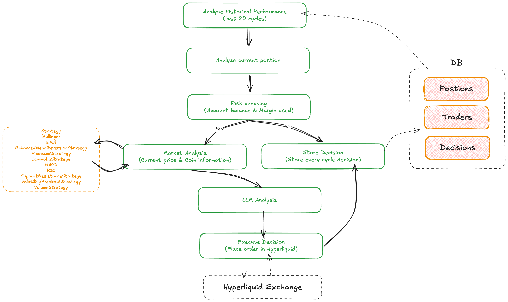

# LangTrader 🤖

[](https://www.python.org/)
[](https://www.langchain.com/)
[](https://langchain-ai.github.io/langgraph/)
[](https://hyperliquid.xyz/)
[](https://github.com/Delgan/loguru)
[](LICENSE)
[](https://github.com/astral-sh/uv)

AI-powered cryptocurrency trading bot using LangChain and Hyperliquid DEX.

**Official X: @AIBTCAI** [@AIBTCAI](https://x.com/AIBTCAI)

## 🚀 Overview

LangTrader is a powerful, open-source AI-driven cryptocurrency trading bot built on top of [LangChain](https://www.langchain.com/), [LangGraph](https://langchain-ai.github.io/langgraph/), and the decentralized exchange [Hyperliquid](https://hyperliquid.xyz/). Leveraging the latest advancements in Python, AI, and on-chain trading, LangTrader automates trading decisions with sophisticated technical indicator analysis, advanced logging via Loguru, and seamless DEX integration.
### 📦 Structure



### 🎯 Key Features

- **🤖 AI-Powered Trading**: Executes trades automatically based on real-time technical indicator signals (e.g., RSI, MACD, Bollinger Bands, SMA/EMA) and AI-driven insights.
- **🧠 Advanced AI Integration**: Utilizes the LangChain ecosystem and LangGraph for sophisticated decision-making workflows with multiple AI agents.
- **⚡ Hyperliquid DEX Support**: Place and manage orders, leverage positions, and handle risk on the Hyperliquid decentralized exchange.
- **📋 Detailed Logging**: All actions and decisions are logged using Loguru for transparency and easy debugging.
- **💾 Database Integration**: Stores trading decisions, positions, and performance metrics in a PostgreSQL database for analysis and backtesting.
- **📊 Position Management**: Tracks open positions, calculates realized/unrealized PnL, and manages stop-loss/take-profit levels.
- **🛡️ Risk Management**: Implements configurable risk controls including maximum leverage, stop-loss percentages, and position sizing.
- **📈 Historical Performance Analysis**: Analyzes past trading performance to inform future decisions.
- **🔧 Customizable & Extensible**: Modular architecture makes it easy to add strategies, indicators, or integrate with other AI services.
- **🌐 RESTful API**: Built-in FastAPI server for monitoring and controlling the trading bot remotely.

## 📦 Prerequisites

Before you begin, ensure you have met the following requirements:

- Python 3.12 or higher
- PostgreSQL database
- Hyperliquid account with API access
- uv package manager (recommended)

## 🛠️ Installation

### 1. Clone the Repository

```bash
git clone https://github.com/your-username/LangTrader.git
cd LangTrader/simper-trader
```

### 2. Install Dependencies

Using uv (recommended):

```bash
uv sync
```

Or using pip:

```bash
pip install -r requirements.txt
```

### 3. Environment Configuration

Create a `.env` file in the project root with the following configuration:

```env
# Database Configuration
dbHost=localhost
dbPort=5432
dbBase=langtrader
dbUser=your_username
dbPass=your_password

# Hyperliquid API Configuration
ACCOUNT_ADDRESS=your_account_address
SECRET_KEY=your_secret_key

# LLM Configuration
OPENAI_API_KEY=your_openai_api_key
```

### 4. Database Setup

Initialize the PostgreSQL database with the required schema:

```bash
# Create database
createdb langtrader

# Run database migrations (if applicable)
# python scripts/init_db.py
```

## ▶️ Usage

### Running the Trading Bot

```bash
# Run the main trading bot
uv run python main.py
```

### Running the API Server

```bash
# Start the FastAPI server
uv run python server.py
```

### Running Tests

```bash
# Run all tests
uv run pytest

# Run specific test file
uv run pytest tests/test_market.py

# Run tests with coverage
uv run pytest --cov=src --cov-report=html
```

### API Endpoints

Once the server is running, you can access the following endpoints:

- `GET /` - Health check endpoint
- `GET /market?symbol=BTC` - Get market data for a symbol
- `GET /config?trader_id=your_id` - Get trader configuration
- `POST /config` - Update trader configuration
- `GET /hyperliquidBalance` - Get Hyperliquid account balance
- `POST /hyperliquidCloseAllPositions` - Close all open positions

## 🧪 Testing

LangTrader includes comprehensive unit tests for all core components:

```bash
# Run all tests
uv run pytest

# Run tests with verbose output
uv run pytest -v

# Run specific test category
uv run pytest tests/test_strategy.py
```

## 📊 Architecture

LangTrader follows a modular architecture with the following key components:

1. **Decision Engine**: Core AI-powered decision making using LangGraph
2. **Market Data Fetcher**: Retrieves real-time market data from Hyperliquid
3. **Strategy Modules**: Multiple technical analysis strategies
4. **Risk Management**: Implements trading risk controls
5. **Exchange Interface**: Communicates with Hyperliquid DEX
6. **Database Layer**: Stores trading data and performance metrics
7. **API Server**: Provides RESTful interface for monitoring and control

## 📈 Trading Strategies

LangTrader implements multiple technical analysis strategies:

- **Enhanced Mean Reversion**: Uses Z-Score and RSI for mean reversion signals
- **Volatility Breakout**: Identifies breakouts based on ATR indicators
- **Ichimoku Cloud**: Comprehensive trend analysis using Ichimoku indicators
- **Volume Analysis**: Trading signals based on volume patterns
- **Support & Resistance**: Identifies key price levels
- **Fibonacci Retracement**: Uses Fibonacci levels for entry/exit points
- **RSI/MACD/Bollinger Bands**: Classic technical indicators

## ⚠️ Disclaimer

This project is for educational purposes only and not financial advice. Cryptocurrency trading involves substantial risk of loss. Use at your own risk. The developers are not responsible for any financial losses incurred through the use of this software.

## 📅 Development Progress

- ✅ 05/11/2025: Finish basic structure of project, fetch marketing info & simply analyze trade signal & place order & cancel order
- ✅ 06/11/2025: Restructure project & add unit testing & init database, Now you can run `uv run pytest`
- ✅ 06/11/2025: Add FastAPI & database
- ✅ 10/11/2025: Add LangGraph & finish main parts
- ✅ 12/11/2025: Implement position tracking, PnL calculation, and database storage for trading decisions and positions
- ✅ 12/11/2025: Add trend-following logic to prevent unnecessary closing of positions when trend continues

## 📋 To-Do List

- [ ] Implement more sophisticated trading strategies
- [ ] Add backtesting capabilities
- [ ] Implement advanced risk management features
- [ ] Add support for multiple trading pairs
- [ ] Improve error handling and recovery mechanisms
- [ ] Add more comprehensive logging and monitoring
- [ ] Implement position sizing based on volatility
- [ ] Add web dashboard for monitoring and configuration
- [ ] Implement paper trading mode
- [ ] Add support for other DEXs and CEXs

## 🤝 Contributing

Contributions are welcome! Please feel free to submit a Pull Request.

1. Fork the repository
2. Create your feature branch (`git checkout -b feature/AmazingFeature`)
3. Commit your changes (`git commit -m 'Add some AmazingFeature'`)
4. Push to the branch (`git push origin feature/AmazingFeature`)
5. Open a Pull Request

## 📄 License

This project is licensed under the MIT License - see the [LICENSE](LICENSE) file for details.

## 📧 Contact

For support or inquiries, please reach out to us on X: [@AIBTCAI](https://x.com/AIBTCAI)

